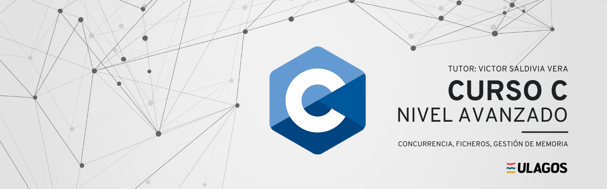

# Repositorio Nivel Avanzado C

   
   

## Descripción del Repositorio

Este repositorio está diseñado para proporcionar a los estudiantes una inmersión profunda en los aspectos avanzados de la programación en el lenguaje C. En este curso, aprenderás todo lo que necesitas saber para escribir código de C de alto rendimiento. Desde programación concurrente, gestión de archivos, estrategias avanzadas de manejo de memoria, seguridad y optimización de código en C.

El curso se enfoca en ejercicios prácticos que te permitirán aplicar lo aprendido y fortalecer tus habilidades. A través de ejercicios y mini-proyectos, podrás experimentar con el código para crear soluciones prácticas. Las prácticas te ayudarán a reforzar tus habilidades básicas, mientras que los mini-proyectos te desafiarán a aplicar tus conocimientos en situaciones reales.

El repositorio se mantendrá actualizado durante este año 2023, lo que significa que siempre tendrás acceso a contenido nuevo y relevante a medida que avances en tu aprendizaje.

¡Visita este curso y comienza tu viaje en la programación en C!

Nota: Se recomienda ver un repositorio de fundamentos de C para entender lo que se explica en este repositorio.

## Enlaces de Interés

- Documentación Lenguaje C [(Documentación C)][c]
- Visual Studio Code [(Editor de Texto)][vscode]

[c]: https://devdocs.io/c/
[vscode]: https://code.visualstudio.com/download

